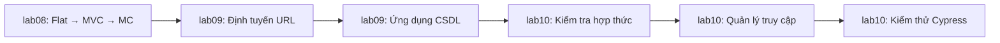

# Bài lab INT3306

Nguồn: cột "Thực hành trên lớp" và "Tự thực hành ở nhà" trong lịch học trên https://itest.com.vn/lects/int3306.htm (cập nhật 03/9/2026). Đề lấy ngày 26/9/2026.

Mỗi thư mục `labXX/` ứng với tuần XX trong lịch học. Trong đó có:

- `README.md`: đề đã tóm tắt, checklist yêu cầu, link đề gốc.
- `tai-nguyen/`: file đề cho sẵn (ảnh giao diện mẫu, file khởi đầu, mã nguồn mẫu dạng zip).

Bài làm của bạn đặt ngay trong thư mục đó, ví dụ `lab03/letter/`.

| Lab | Tuần | Chủ đề | Trên lớp | Ở nhà |
|---|---|---|---|---|
| [lab01](lab01/README.md) | 1 | Kiến trúc web, HTTP | Không có đề, chỉ đọc thêm | |
| [lab02](lab02/README.md) | 2 | Quản trị ứng dụng web | Quản trị ứng dụng web (LEMP) | |
| [lab03](lab03/README.md) | 3 | HTML, CSS | Letter, Trang tin | Thực đơn, Tab |
| [lab04](lab04/README.md) | 4 | RWD | Flexbox 2, Fluid Typography | Flexbox 1, Grid 1, Grid 2, Stepped Typography |
| [lab05](lab05/README.md) | 5 | JavaScript, DOM, AJAX | Form nhập, Danh sách, Sắp xếp trên bảng, JSON | JS Class, JS Module, Máy tính, AJAX |
| [lab06](lab06/README.md) | 6 | JS bất đồng bộ | JS không đồng bộ, Fetch API, Cây | Hoạt cảnh, Cây (jQuery), Web worker |
| [lab07](lab07/README.md) | 7 | Web động | Bộ lọc, PWA | Form (jQuery), 3 lab Bootstrap, React và JSX |
| [lab08](lab08/README.md) | 8 | URL, CSDL | Thi giữa kỳ | Flat vs MVC vs MC (API) |
| [lab09](lab09/README.md) | 9 | Trạng thái, an ninh | Định tuyến URL, Ứng dụng CSDL | Cookie, Session |
| [lab10](lab10/README.md) | 10 | Framework, kiểm thử | Quản lý truy cập, Kiểm tra hợp thức | Kiểm thử (Cypress) |

Chuỗi lab backend từ tuần 8 đến 10 kế thừa mã nguồn của nhau:

Trang môn học không ghi hạn nộp hay cách nộp. Thông tin này nằm trên LMS của từng lớp (https://portal.uet.vnu.edu.vn/uet-lms).
