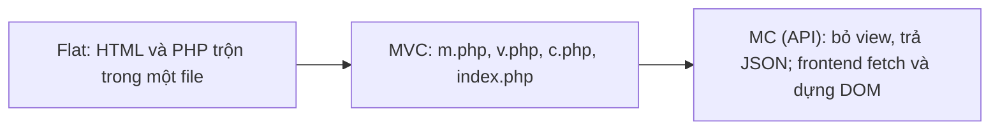

# Lab 08 – Tuần 8: Flat vs MVC vs MC (API)

Nguồn: https://itest.com.vn/lects/webappdev/mvc/ (ở nhà). Buổi trên lớp tuần 8 là **thi giữa kỳ** (trắc nghiệm trên máy).

Mục tiêu: viết backend theo mô hình MC. Backend nhận dữ liệu form hoặc JSON và trả về JSON. Frontend dùng `fetch` lấy JSON rồi cập nhật DOM.

Tài nguyên: `tai-nguyen/mvc_flat_flat.zip`, `mvc_mvc_mvc.zip`, `mvc_mc_mc.zip` (PHP). Chạy trên Nginx + PHP-FPM của lab02.

## Checklist

- [ ] Phân tích bản [Flat](https://itest.com.vn/lects/webappdev/mvc/flat)
- [ ] Phân tích bản [MVC](https://itest.com.vn/lects/webappdev/mvc/mvc): vai trò của `m.php` (model), `v.php` (view), `c.php` (controller), `index.php`
- [ ] Tự nâng cấp MVC lên MC: bỏ view, model trả về JSON, frontend gọi bằng AJAX hoặc `fetch` rồi cập nhật DOM
- [ ] Đối chiếu với bản mẫu [MC](https://itest.com.vn/lects/webappdev/mvc/mc/frontend.htm)

Đọc thêm: [Prisma](https://www.prisma.io).
