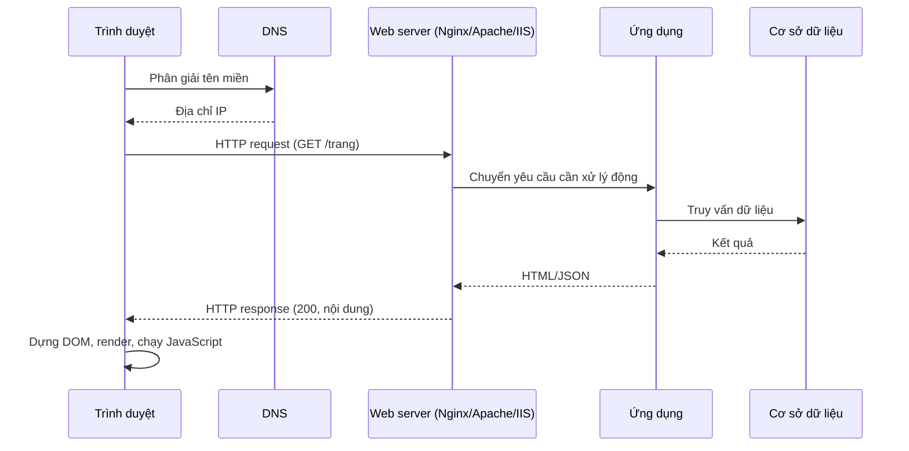
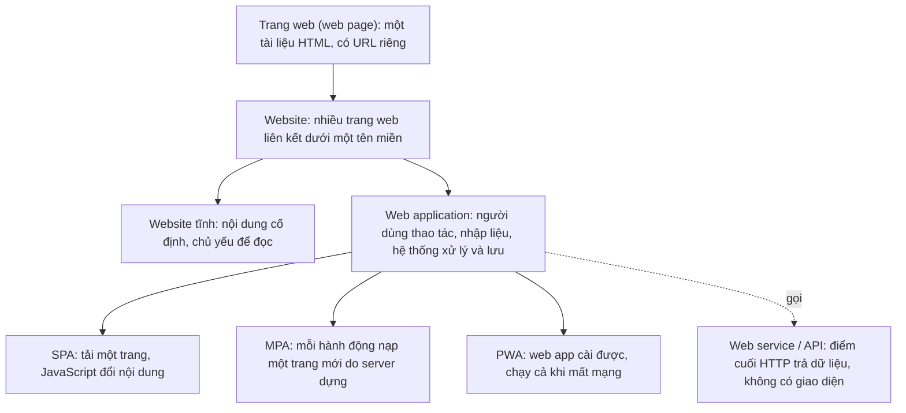
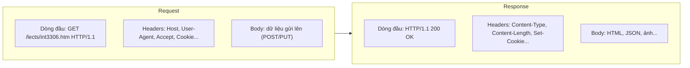

# Bài 1 – Kiến trúc ứng dụng web và giao thức HTTP

Nguồn: Lê Đình Thanh, Nguyễn Việt Anh, *Phát triển ứng dụng web* (NXB ĐHQGHN, 2019); MDN *Learn web development*; RFC 9110, 9112, 9113, 9114; thống kê w3techs.

---

## 1. Web hoạt động theo mô hình client – server

Trình duyệt (client) tra hệ thống tên miền (DNS, Domain Name System) để biết địa chỉ IP, rồi gửi một yêu cầu (request) tới máy chủ web (web server); máy chủ xử lý và trả về phản hồi (response). Mọi trao đổi đi qua giao thức HTTP (HyperText Transfer Protocol) nằm trên TCP/IP (Transmission Control Protocol / Internet Protocol).

Một request điển hình đi qua các chặng sau:



Bước cuối, trình duyệt dựng cây tài liệu (DOM, Document Object Model) rồi hiển thị.

Web tĩnh (static): máy chủ trả về đúng tệp có sẵn. Web động (dynamic): ứng dụng sinh nội dung theo từng request, thường có truy vấn cơ sở dữ liệu.

w3techs cho số liệu thị phần của web server, ngôn ngữ, framework đang dùng thực tế trên Internet. Đọc để biết công nghệ nào phổ biến trước khi chọn học sâu.

---

## 2. Trang web, website, web app và các loại liên quan

Quan hệ giữa các khái niệm:



Bảng phân biệt:

| Khái niệm | Là gì | Ví dụ |
|---|---|---|
| Trang web (web page) | Một tài liệu hiển thị trong trình duyệt, định danh bằng URL | Trang bài giảng này |
| Website | Nhóm trang web liên kết nhau dưới một tên miền | itest.com.vn |
| Website tĩnh | Nội dung như nhau với mọi người, chủ yếu để đọc | Blog, trang giới thiệu |
| Web application | Website mà người dùng tương tác để làm việc: đăng nhập, nhập liệu, xử lý, lưu | Gmail, Google Docs |
| SPA (single-page application) | Tải một lần, JavaScript cập nhật nội dung, ít nạp lại trang | Ứng dụng dùng client-side routing |
| MPA (multi-page application) | Mỗi hành động nạp một trang mới do máy chủ dựng | Trang thương mại điện tử truyền thống |
| PWA (progressive web app) | Web app cài lên máy, chạy offline nhờ service worker | Học kỹ ở bài 6 |
| Web service / API (Application Programming Interface) | Điểm cuối (endpoint) HTTP trả dữ liệu (thường JSON) cho chương trình khác | REST (Representational State Transfer) API |
| Web portal | Cổng gom nhiều dịch vụ và thông tin vào một nơi | Cổng thông tin sinh viên |

Ranh giới website và web app không rạch ròi. Càng nhiều tương tác và xử lý theo từng người dùng thì càng nghiêng về web app. Môn học tập trung vào web app động.

---

## 3. URL – địa chỉ của tài nguyên

URL (Uniform Resource Locator) là địa chỉ đầy đủ của một tài nguyên trên web:

```
https://itest.com.vn:443/lects/int3306.htm?lang=vi#muc2
└─┬─┘   └────┬─────┘ └┬┘ └──────┬───────┘ └───┬──┘ └─┬─┘
scheme     host     port      path          query  fragment
```

- **scheme**: giao thức, thường `http` hoặc `https`.
- **host**: tên miền hoặc IP của máy chủ.
- **port**: cổng, mặc định 80 cho HTTP và 443 cho HTTPS nên thường bỏ.
- **path**: đường dẫn tới tài nguyên trên máy chủ.
- **query**: tham số dạng `khoa=giatri`, nối nhau bằng `&`.
- **fragment**: vị trí bên trong trang, trình duyệt xử lý, không gửi lên máy chủ.

Ký tự ngoài tập cho phép phải mã hóa phần trăm (percent-encoding), ví dụ dấu cách thành `%20`. Dịch vụ rút gọn URL chỉ là một bản ghi chuyển hướng từ địa chỉ ngắn sang địa chỉ gốc.

---

## 4. HTTP – cách client và server nói chuyện

HTTP là giao thức dạng văn bản, không lưu trạng thái (stateless). Mỗi request độc lập, máy chủ không tự nhớ request trước đó. Muốn có trạng thái đăng nhập phải dùng cookie hoặc phiên làm việc (session), học ở bài sau.

Mỗi request và response gồm ba phần: dòng đầu (request line hoặc status line), các header, và phần thân (body).

Sơ đồ một cặp request và response:



**Các phương thức chính (HTTP method)**

| Phương thức | Dùng để | Có thân yêu cầu | An toàn (safe) / Bất biến khi lặp (idempotent) |
|---|---|---|---|
| GET | Lấy tài nguyên | Không | An toàn, idempotent |
| POST | Tạo mới, gửi biểu mẫu | Có | Không |
| PUT | Thay thế toàn bộ tài nguyên | Có | Idempotent |
| PATCH | Sửa một phần | Có | Không |
| DELETE | Xóa | Không | Idempotent |
| HEAD | Như GET nhưng chỉ lấy header | Không | An toàn |
| OPTIONS | Hỏi máy chủ hỗ trợ gì | Không | An toàn |

**Nhóm mã trạng thái (status code)**

| Nhóm | Ý nghĩa | Ví dụ hay gặp |
|---|---|---|
| 1xx | Thông tin | 100 Continue |
| 2xx | Thành công | 200 OK, 201 Created, 204 No Content |
| 3xx | Chuyển hướng | 301 Moved Permanently, 302 Found, 304 Not Modified |
| 4xx | Lỗi phía client | 400 Bad Request, 401 Unauthorized, 403 Forbidden, 404 Not Found |
| 5xx | Lỗi phía server | 500 Internal Server Error, 502 Bad Gateway, 503 Service Unavailable |

RFC 9110 định nghĩa phần ngữ nghĩa chung: phương thức, mã trạng thái, header. Các RFC còn lại mô tả cách truyền dữ liệu qua từng phiên bản.

---

## 5. Các phiên bản HTTP

| Phiên bản | RFC | Điểm chính |
|---|---|---|
| HTTP/1.1 | 9112 | Văn bản thuần. Kết nối giữ lại dùng cho nhiều request (persistent connection, keep-alive). Bị nghẽn đầu hàng (head-of-line blocking): request trước chậm thì request sau phải chờ. |
| HTTP/2 | 9113 | Đóng gói nhị phân. Nhiều luồng chạy song song trên một kết nối (multiplexing). Nén header (header compression). |
| HTTP/3 | 9114 | Chạy trên QUIC (nền UDP, User Datagram Protocol) thay cho TCP. Thiết lập kết nối nhanh hơn, không còn nghẽn đầu hàng ở tầng vận chuyển. |

Cả ba phiên bản dùng chung ngữ nghĩa ở RFC 9110, chỉ khác cách bọc và gửi dữ liệu.

---

## 6. Máy chủ web

Nginx, Apache HTTP Server, IIS là ba phần mềm máy chủ phổ biến. Chúng nhận kết nối HTTP, phục vụ tệp tĩnh, và chuyển các request cần xử lý động sang tầng ứng dụng. Nginx còn hay dùng làm proxy ngược (reverse proxy) và cân bằng tải (load balancing).

---

## 7. Việc cần làm tuần này

- Đọc chương kiến trúc web trong giáo trình và mục *What is a web server*, *Overview of HTTP* trên MDN.
- Xem qua RFC 9110: phần danh sách phương thức và mã trạng thái.
- Vào w3techs, ghi lại thị phần hiện tại của web server và ngôn ngữ phía server.
- Mở DevTools của trình duyệt, tab Network, tải lại một trang bất kỳ và đọc dòng đầu, header, mã trạng thái của vài yêu cầu.
- Chọn hai trang quen thuộc, phân loại một trang là website tĩnh và một trang là web app, giải thích căn cứ.
