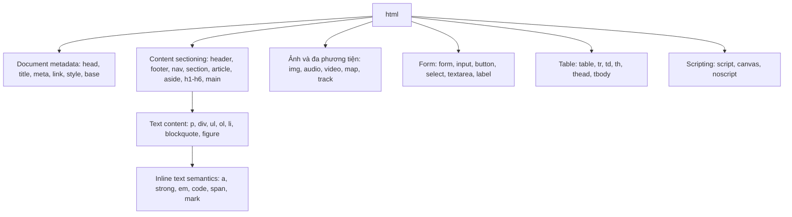
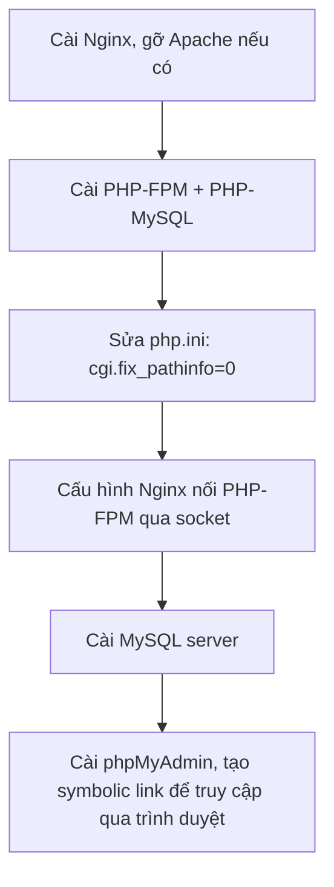
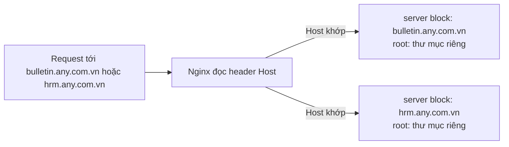

# Bài 2 – HTML và quản trị ứng dụng web

Nguồn: Lê Đình Thanh, Nguyễn Việt Anh, *Phát triển ứng dụng web* (NXB ĐHQGHN, 2019); MDN *HTML elements reference*; W3Schools *Charsets*; bài lab quản trị ứng dụng web (Nginx/LEMP) trên itest.com.vn; WebKit.org; Selenium.dev. Slide bài giảng trên itest.com.vn/lects/webappdev/slides/ không đọc được nội dung (trang cần JavaScript để dựng), chỉ ghi nhận đường dẫn.

---

## 1. Tài liệu HTML là gì

HTML (HyperText Markup Language) là ngôn ngữ đánh dấu mô tả cấu trúc một trang web. Trình duyệt đọc HTML, dựng cây tài liệu (DOM), rồi hiển thị.

Khung tối thiểu của một tài liệu HTML:

```html
<!DOCTYPE html>
<html>
  <head>
    <meta charset="UTF-8">
    <title>Page Title</title>
  </head>
  <body>
    <header><nav>Navigation</nav></header>
    <main>
      <article>
        <h1>Heading</h1>
        <p>Content here</p>
      </article>
    </main>
    <footer>Footer content</footer>
  </body>
</html>
```

`<!DOCTYPE html>` báo trình duyệt dựng trang theo chuẩn HTML5. `<head>` chứa dữ liệu mô tả trang (metadata), không hiển thị trực tiếp. `<body>` chứa nội dung hiển thị.

---

## 2. Phân loại các nhóm phần tử (element)

MDN nhóm các phần tử HTML theo vai trò:



Một số phần tử đã lỗi thời (deprecated), không nên dùng: `marquee`, `font`, `frame`, `frameset`, `big`, `center`. Thay bằng CSS.

---

## 3. Bảng mã ký tự (charset)

Bộ ký tự (charset) quyết định trình duyệt diễn giải byte trong tệp HTML thành chữ nào. Khai báo ở đầu `<head>`:

```html
<meta charset="UTF-8">
```

UTF-8 là bảng mã mặc định của web hiện đại, phủ hầu hết ngôn ngữ và ký hiệu (kể cả emoji). Các bảng mã cũ hơn: ASCII (chỉ ký tự tiếng Anh cơ bản), ISO-8859-1/Latin-1 (ký tự Châu Âu), WIN-1252 (bảng mã Windows). Thiếu khai báo charset hoặc khai sai làm trang hiển thị ký tự lỗi (mojibake).

---

## 4. Trình duyệt và động cơ render

Trình duyệt dùng một động cơ render (rendering engine) để dựng HTML/CSS/JavaScript thành trang hiển thị. WebKit là một động cơ mã nguồn mở, chạy dưới Safari, Mail, App Store trên macOS/iOS/Linux. Các trình duyệt khác dùng động cơ riêng (ví dụ Chromium dùng Blink, Firefox dùng Gecko), nên cùng một trang HTML có thể hiển thị hơi khác nhau giữa các trình duyệt. Đây là lý do cần kiểm thử đa trình duyệt.

Selenium là công cụ tự động hóa trình duyệt (browser automation), dùng để kiểm thử ứng dụng web tự động thay vì bấm tay. Ba thành phần:

| Thành phần | Vai trò |
|---|---|
| Selenium WebDriver | Điều khiển trình duyệt theo mã lệnh, xây bộ kiểm thử tự động |
| Selenium IDE | Tiện ích mở rộng ghi lại và phát lại thao tác trên trình duyệt |
| Selenium Grid | Chạy song song bộ kiểm thử trên nhiều máy/môi trường |

---

## 5. Quản trị ứng dụng web: LEMP stack

Lab dùng LEMP (Linux, Nginx, MySQL, PHP) thay cho LAMP truyền thống (thay Apache bằng Nginx). Nginx nhẹ, xử lý đồng thời tốt hơn nhưng ít module dựng sẵn hơn Apache.

Luồng cài đặt một máy chủ LEMP:



PHP-FPM (FastCGI Process Manager) là tiến trình chạy PHP riêng biệt; Nginx tự nó không chạy được mã PHP nên phải chuyển tiếp (proxy) yêu cầu tới PHP-FPM qua socket. Đặt `cgi.fix_pathinfo=0` để tránh lỗi bảo mật khi Nginx xác định sai tệp PHP cần chạy.

### Lưu trữ nhiều ứng dụng trên một máy chủ (virtual hosting)

Một máy Nginx có thể phục vụ nhiều tên miền cùng lúc, mỗi tên miền một cấu hình riêng gọi là server block:



Các bước dựng thêm một ứng dụng:

1. Thêm ánh xạ tên miền vào `/etc/hosts` (môi trường thử nghiệm, chưa có DNS thật).
2. Tạo thư mục gốc (document root) riêng cho ứng dụng, đặt quyền 755.
3. Viết server block riêng, chỉ định `server_name` và `root`.
4. Bật server block bằng symbolic link (thường từ `sites-available` sang `sites-enabled`).
5. Khởi động lại Nginx để áp dụng cấu hình.

---

## 6. Việc cần làm tuần này

- Xem slide bài HTML trên hệ thống LMS của trường (link trên itest.com.vn không tải được nội dung do cần JavaScript).
- Đọc mục HTML elements reference trên MDN, phân biệt các nhóm phần tử.
- Làm lab: cài LEMP (Nginx, PHP-FPM, MySQL, phpMyAdmin) trên máy ảo/Ubuntu, dựng ít nhất hai server block cho hai tên miền giả lập qua `/etc/hosts`.
- Viết một trang HTML tối thiểu, khai báo đúng charset UTF-8, dùng đủ các nhóm phần tử: sectioning, text content, form, table.
- Cài thử Selenium WebDriver, viết một kịch bản mở trình duyệt và kiểm tra tiêu đề trang.
