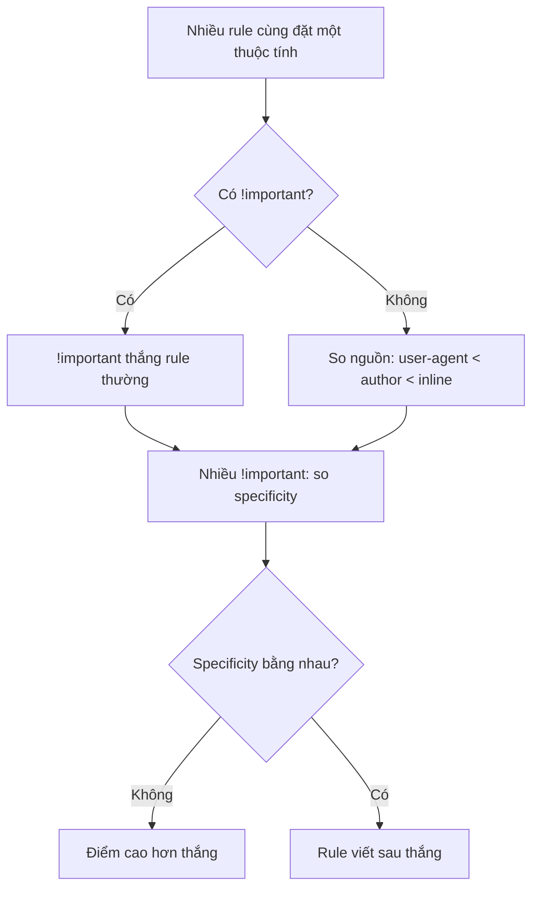
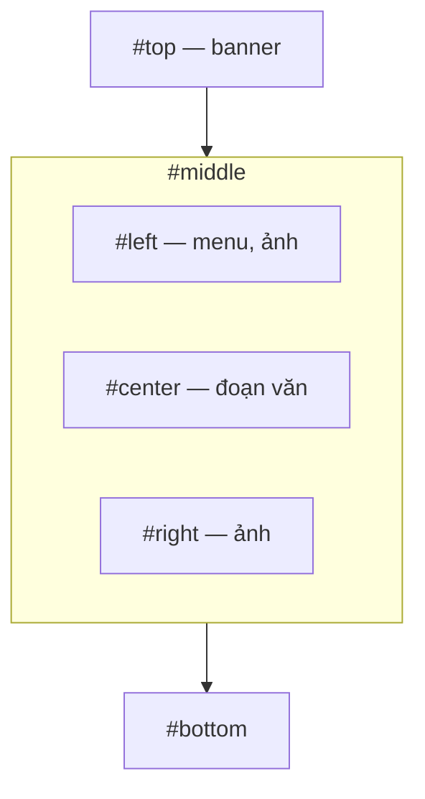

# Bài 3 – CSS và typography

Nguồn: MDN *CSS Reference*; MDN *CSS values and units*; MDN *Using CSS custom properties*; Wikipedia *Web colors*; CSS-Tricks *Specifics on CSS Specificity*; CSS-Tricks *Complete Guide to CSS Functions*; Jens Oliver Meiert *User-agent style sheets*; bài lab Letter, Trang tin, Thực đơn, Tab trên itest.com.vn. Slide bài giảng trỏ sang thư mục Google Drive cần đăng nhập, chỉ ghi nhận đường dẫn: `itest.com.vn/lects/webappdev/slides/`.

---

## 1. CSS làm gì

CSS (Cascading Style Sheets) mô tả cách trình bày tài liệu HTML. HTML lo cấu trúc và ngữ nghĩa, CSS lo hình thức.

Một quy tắc (rule) gồm bộ chọn (selector) và khối khai báo:

```css
selector {
  property: value;
}
```

Cú pháp đầy đủ theo MDN:

```
style-rule ::= selectors-list { properties-list }
selectors-list ::= selector[:pseudo-class] [::pseudo-element] [, selectors-list]
properties-list ::= [property : value] [; properties-list]
```

Ví dụ:

```css
strong {
  color: red;
}

div.menu-bar li:hover > ul {
  display: block;
}
```

Ba cách gắn CSS vào trang:

| Cách | Viết ở đâu | Dùng khi |
|---|---|---|
| Inline | thuộc tính `style` trên thẻ | sửa một phần tử duy nhất |
| Internal | `<style>` trong `<head>` | trang đơn lẻ |
| External | `<link rel="stylesheet" href="...">` | dùng chung nhiều trang |

---

## 2. Bộ chọn

| Loại | Ví dụ | Chọn cái gì |
|---|---|---|
| Type | `p` | mọi phần tử `<p>` |
| Class | `.favorite` | phần tử có `class="favorite"` |
| ID | `#summer-drinks` | phần tử có `id="summer-drinks"` |
| Attribute | `input[type="text"]` | theo thuộc tính |
| Pseudo-class | `li:hover`, `:first-child` | theo trạng thái hoặc vị trí |
| Pseudo-element | `p::before`, `::selection` | một phần ảo của phần tử |
| Universal | `*` | mọi phần tử |

Các bộ kết hợp (combinator) ghép bộ chọn theo quan hệ trong cây tài liệu: `A B` là con cháu, `A > B` là con trực tiếp, `A + B` là anh em liền kề, `A ~ B` là anh em cùng cấp.

---

## 3. Cascade: rule nào thắng

Khi nhiều rule cùng nhắm một phần tử, trình duyệt phải chọn. Thứ tự xét:



### Bảng style mặc định của trình duyệt

Mỗi trình duyệt (user agent) mang sẵn một bảng style mặc định (user-agent style sheet) để tài liệu không có CSS vẫn hiển thị hợp lý: heading to đậm, danh sách có dấu chấm, link màu xanh gạch chân. Đây là tầng thấp nhất của cascade, CSS của tác giả trang luôn đè lên được.

Các trình duyệt khác nhau đặt mặc định khác nhau, nên một trang không CSS hiển thị không giống nhau giữa Chromium, Gecko và WebKit. Meiert lưu trữ bảng style mặc định của nhiều phiên bản trình duyệt để tra cứu, đồng thời khuyên không lạm dụng reset style sheet: phần lớn trường hợp `* { margin: 0; padding: 0; }` là đủ.

### Độ ưu tiên (specificity)

Specificity là bộ bốn số đếm thành phần trong bộ chọn:

| Thành phần | Điểm |
|---|---|
| Style inline | 1,0,0,0 |
| ID | 0,1,0,0 |
| Class, pseudo-class, attribute | 0,0,1,0 |
| Tên phần tử, pseudo-element | 0,0,0,1 |
| Universal `*` | 0,0,0,0 |

Bốn số này không cộng dồn kiểu hệ thập phân. Một ID luôn thắng mọi số lượng class:

```css
.favorite            { color: red; }    /* 0,0,1,0 */
ul#summer-drinks li  { color: black; }  /* 0,1,0,2 — thắng */
```

`:not()` tự nó không thêm điểm, chỉ nội dung bên trong nó được tính. `!important` đè lên rule thường nhưng bị một `!important` khác có specificity bằng hoặc cao hơn đè lại. Nên viết bộ chọn vừa đủ cụ thể để khớp đúng phần tử cần khớp, vì bộ chọn càng nặng điểm thì càng khó ghi đè về sau.

---

## 4. Giá trị và đơn vị

Các kiểu số: `<integer>` (1024), `<number>` (0.255), `<dimension>` (số kèm đơn vị: 10px, 45deg), `<percentage>` (50%).

Đơn vị độ dài tuyệt đối, quy đổi cố định:

| Đơn vị | Bằng |
|---|---|
| `px` | 1/96 inch |
| `in` | 96px |
| `cm` | 37.8px |
| `mm` | 1/10 cm |
| `pt` | 1/72 inch |
| `pc` | 1/6 inch |

Đơn vị tương đối, phụ thuộc ngữ cảnh:

| Đơn vị | So với |
|---|---|
| `em` | cỡ chữ của phần tử hoặc của phần tử cha |
| `rem` | cỡ chữ của phần tử gốc `<html>` |
| `vw`, `vh` | chiều rộng, chiều cao khung nhìn (viewport) |
| `%` | giá trị tương ứng của phần tử cha |

`em` lồng nhau thì nhân dồn: một `<li>` cỡ 1.2em nằm trong `<ul>` cũng 1.2em sẽ ra 1.44 lần cỡ gốc. `rem` luôn neo vào gốc nên tránh được hiệu ứng này.

Năm cách viết màu:

```css
color: rebeccapurple;              /* từ khóa */
color: #ff00ff;                    /* hex */
color: #f0f;                       /* hex rút gọn */
color: #ff00ff66;                  /* hex kèm alpha */
color: rgb(2 121 139);
color: rgb(197 93 161 / 0.7);      /* alpha sau dấu / */
color: hsl(188 97% 28%);
color: hwb(90 10% 10%);
```

---

## 5. Màu trên web

Một màu hex triplet mô tả cường độ ba kênh đỏ, lục, lam, mỗi kênh 8 bit. Độ sâu 24 bit cho 16.777.216 màu; dạng rút gọn ba chữ số chỉ cho 4.096 màu.

HTML 4.01 định nghĩa 16 màu cơ bản lấy từ bảng màu VGA của Windows. Trình duyệt hiện đại hiểu thêm 140 tên màu mở rộng có gốc từ bảng màu X11, nay đã chuẩn hóa trong SVG và CSS.

Bảng màu an toàn 216 màu (web-safe) từng quan trọng giữa thập niên 1990 khi màn hình chỉ hiện được 256 màu, giờ không còn ý nghĩa vì màn hình 24 bit là mặc định. Ngoài sRGB, CSS hiện đại còn hỗ trợ các không gian màu độc lập thiết bị như OKLab và Display P3.

Hướng dẫn về khả năng tiếp cận (accessibility) khuyến nghị tỉ lệ tương phản giữa chữ và nền tối thiểu 4.5:1.

---

## 6. Hàm CSS

| Nhóm | Hàm | Ví dụ |
|---|---|---|
| Toán học | `calc()`, `min()`, `max()`, `clamp()` | `calc(100vw - 80px)`, `clamp(320px, 80%, 1200px)` |
| Màu | `rgb()`, `hsl()` | `hsl(100, 100%, 50%)` |
| Biến đổi | `translate()`, `rotate()`, `scale()`, `skew()` | `transform: translate(-50%, -50%)` |
| Bộ lọc | `blur()`, `brightness()`, `grayscale()`, `drop-shadow()` | `filter: blur(4px)` |
| Gradient | `linear-gradient()`, `radial-gradient()`, `conic-gradient()` | `background: linear-gradient(90deg, red, blue)` |
| Khác | `url()`, `attr()`, `var()`, `counter()` | `url('/images/a.jpg')` |

`clamp(min, preferred, max)` giữ giá trị mong muốn chừng nào nó còn nằm giữa hai cận. Bài 4 dùng hàm này cho fluid typography.

---

## 7. Biến CSS

Biến CSS, tên chính thức là thuộc tính tùy biến (custom property), là định danh bắt đầu bằng `--`, đọc lại bằng hàm `var()`.

```css
:root {
  --first-color: #1166ff;
  --second-color: #ffff77;
}

#firstParagraph {
  background-color: var(--first-color);
  color: var(--second-color);
}
```

Tên biến phân biệt hoa thường: `--my-color` khác `--My-color`. Gọi `var(--x, fallback)` để đặt giá trị dự phòng khi `--x` chưa khai báo.

Biến có phạm vi theo phần tử khai báo nó và được kế thừa xuống con, nên khai lại ở phần tử con sẽ đè giá trị trong nhánh đó:

```css
#container {
  --first-color: #229900;  /* chỉ đổi trong #container */
}
```

Khai báo `@property` cho phép ràng buộc kiểu, tính kế thừa và giá trị khởi tạo của biến:

```css
@property --itemSize {
  syntax: "<length> | <percentage>";
  inherits: true;
  initial-value: 200px;
}
```

---

## 8. Typography

Các thuộc tính chữ, chia hai nhóm:

| Nhóm font | Việc |
|---|---|
| `font-family` | chọn bộ chữ, liệt kê dự phòng theo thứ tự |
| `font-size` | cỡ chữ |
| `font-weight` | độ đậm |
| `line-height` | khoảng cách dòng |

| Nhóm text | Việc |
|---|---|
| `letter-spacing`, `word-spacing` | giãn chữ cái, giãn từ |
| `text-align` | canh lề |
| `text-decoration` | gạch chân, gạch ngang |
| `text-transform` | đổi hoa thường |
| `text-indent` | thụt đầu dòng |
| `text-shadow` | đổ bóng chữ |
| `text-overflow` | xử lý chữ tràn |

Nạp font riêng bằng at-rule `@font-face`. Các at-rule khác hay dùng: `@media` (theo thiết bị), `@import` (nhập tệp CSS khác), `@supports` (kiểm tra trình duyệt có hiểu thuộc tính không), `@keyframes` (định nghĩa animation), `@layer` (xếp tầng cascade).

---

## 9. Bố cục bằng float (lab Trang tin)

Lab Trang tin dựng layout theo kiểu cổ điển: chia vùng bằng `div`, xếp ngang bằng `float`, rồi ngắt dòng bằng `clear`.

Các vùng của trang:



```html
<div id="top"></div>
<div id="middle">
    <div id="left"></div>
    <div id="center"></div>
    <div id="right"></div>
    <br class="clear"/>
</div>
<div id="bottom"></div>
<style>
    #left, #center, #right {display:inline; float:left;}
    .clear {clear:both;}
</style>
```

Phần tử `float` bị lấy ra khỏi luồng bình thường nên phần tử cha co lại như không có nó. Thẻ `<br class="clear">` với `clear:both` ép dòng kế tiếp xuống dưới cả ba cột, giữ cho `#bottom` không trèo lên. Bài 4 thay cách làm này bằng Flexbox và Grid.

---

## 10. Bốn bài lab tuần này

| Lab | Mục đích | Yêu cầu chính |
|---|---|---|
| Letter (trên lớp) | Dùng đúng phần tử theo ngữ nghĩa | Đánh dấu một lá thư: `<address>` cho hai địa chỉ, danh sách đúng loại, `<time>` cho bốn mốc ngày, `<abbr>` cho PhD/HTML/CSS/BC/Esq., `<sub>`/`<sup>` cho công thức hóa học và lũy thừa, `<blockquote>` kèm `<cite>` cho câu châm ngôn, khai `charset=utf-8` và meta `author`. Kiểm tra bằng W3C HTML validator |
| Trang tin (trên lớp) | Dựng layout bằng HTML và CSS | Dùng thư viện ảnh và css có sẵn; bước 1 tạo bố cục `top/middle/bottom` bằng float, bước 2 đổ nội dung vào từng vùng |
| Thực đơn (tự làm) | CSS kết hợp JavaScript | Menu sáng lên khi rê chuột; đổi màu xanh khi chọn, tiêu đề mục đang chọn hiện bên phải |
| Tab (tự làm) | CSS kết hợp JavaScript | Tab được chọn tô xanh và tải trang tương ứng; tab chưa chọn sáng lên khi rê chuột |

Lab Letter lấy đề từ MDN *Marking up a letter*, kèm sẵn `letter.txt` (văn bản thô) và `css.txt` (CSS có sẵn để nhúng).

---

## 11. Việc cần làm tuần này

- Xin quyền truy cập thư mục Drive chứa slide bài CSS (link trên itest.com.vn yêu cầu đăng nhập Google).
- Đọc MDN *CSS values and units*, nắm khác biệt `em` với `rem` và khi nào dùng đơn vị tương đối.
- Làm lab Letter, chạy W3C HTML validator cho tới khi sạch lỗi.
- Làm lab Trang tin, hiểu vì sao thiếu `clear:both` thì `#bottom` bị trèo lên.
- Tự làm lab Thực đơn và lab Tab ở nhà, dùng `:hover` cho hiệu ứng rê chuột.
- Thử Specificity Calculator (polypane.app/css-specificity-calculator) với vài bộ chọn của chính mình để kiểm lại cách tính điểm.
