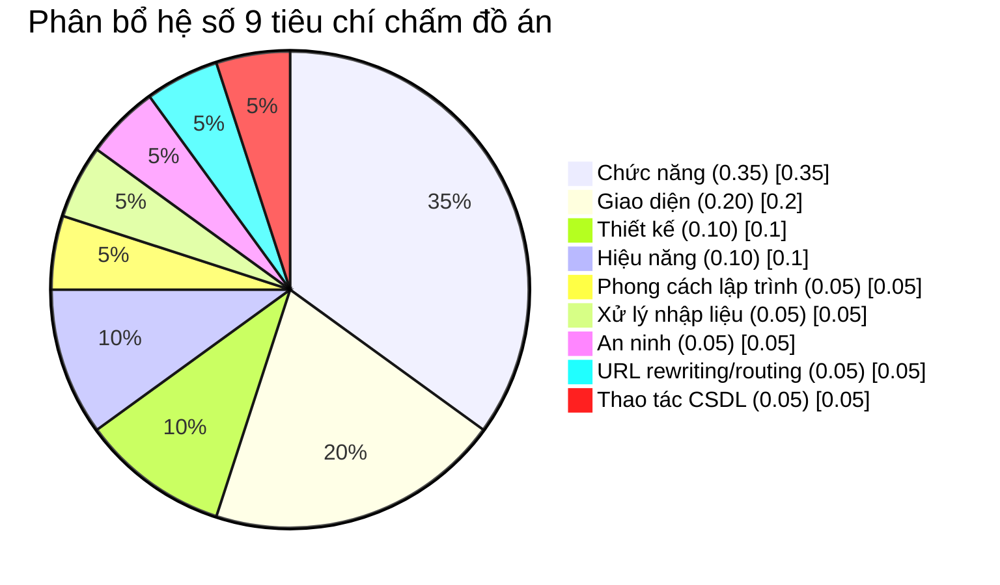

# Checklist bài tập lớn (đồ án nhóm)

Nguồn: Syllabus INT3306 trên portal.uet.vnu.edu.vn (`/courses/7148/assignments/syllabus`), mục "Rubric cuối kỳ" và "Đánh giá học phần".

## Điểm số và trọng số

- Đồ án nhóm là phần Thi kết thúc học phần, chiếm **60%** điểm học phần.
- Rubric chấm theo 9 tiêu chí, hệ số cộng lại bằng 1.0.

## 9 tiêu chí chấm điểm

| # | Tiêu chí | Hệ số |
|---|---|---|
| 1 | Chức năng và các features đã cài đặt | 0.35 |
| 2 | Thiết kế: logic, dễ sử dụng | 0.10 |
| 3 | Giao diện: responsive, đẹp, hiện đại, có bản sắc, đặc trưng nhận dạng thương hiệu nổi bật | 0.20 |
| 4 | Hiệu năng: dùng fetch/AJAX để tải bộ phận (không tải lại cả trang), có backend API, dùng dữ liệu JSON, cập nhật DOM ở frontend | 0.10 |
| 5 | Phong cách lập trình: dùng mẫu thiết kế (design pattern), tách mã giao diện và mã xử lý nghiệp vụ, tổ chức gói thư viện, trình bày và chú thích mã | 0.05 |
| 6 | Xử lý nhập liệu: kiểm tra hợp thức (validation), tự động điền, gợi ý, chuyển đổi dữ liệu | 0.05 |
| 7 | An ninh: xác thực, quản lý phiên, điều khiển truy cập, mã hóa | 0.05 |
| 8 | Viết lại và/hoặc định tuyến URL | 0.05 |
| 9 | Thao tác CSDL theo hướng đối tượng, độc lập với loại CSDL | 0.05 |

## Checklist theo tiêu chí (để tự kiểm trước khi nộp)

- [ ] **Chức năng (0.35)**: đủ tính năng theo đề bài nhóm đã đăng ký, chạy đúng, không lỗi khi thao tác chính.
- [ ] **Giao diện (0.20)**: responsive trên nhiều kích thước màn hình, có bộ nhận diện riêng (màu, logo, font) chứ không dùng mặc định của framework.
- [ ] **Thiết kế (0.10)**: luồng thao tác hợp lý, không cần hướng dẫn vẫn dùng được.
- [ ] **Hiệu năng (0.10)**: các thao tác cập nhật dữ liệu dùng fetch/AJAX, backend trả JSON qua API, không reload toàn trang.
- [ ] **Phong cách lập trình (0.05)**: có áp dụng ít nhất một design pattern (ví dụ MVC), tách rõ tầng giao diện và tầng xử lý, thư mục/module rõ ràng, có chú thích ở chỗ khó hiểu.
- [ ] **Xử lý nhập liệu (0.05)**: validate cả phía client lẫn server, có gợi ý/autocomplete ở các trường phù hợp.
- [ ] **An ninh (0.05)**: có xác thực (đăng nhập), quản lý phiên/token, phân quyền truy cập, mã hóa dữ liệu nhạy cảm (mật khẩu...).
- [ ] **URL rewriting/routing (0.05)**: URL có ý nghĩa, không lộ file thực thi, dùng cơ chế routing của framework hoặc tự viết.
- [ ] **Thao tác CSDL (0.05)**: truy cập CSDL qua lớp đối tượng (ORM hoặc DAO tự viết), không phụ thuộc cứng vào một loại CSDL cụ thể.

## Mốc liên quan trong lịch giảng dạy

- Buổi 9: công bố bài tập lớn (đề tài, thành lập nhóm).
- Buổi 8 (giữa kỳ): kiểm tra trắc nghiệm trên máy, không liên quan điểm đồ án.
- Buổi 16 (theo kế hoạch giảng dạy trong `syllabus/INT3306-syllabus.md`): bảo vệ đồ án, trình bày sản phẩm.

## Việc chưa làm được

- Slide các buổi học (`itest.com.vn/lects/webappdev/slides/`) trỏ tới một thư mục Google Drive yêu cầu xin quyền truy cập; tài khoản hiện tại chưa được cấp quyền nên chưa tải được file slide nào về `assets/`.
